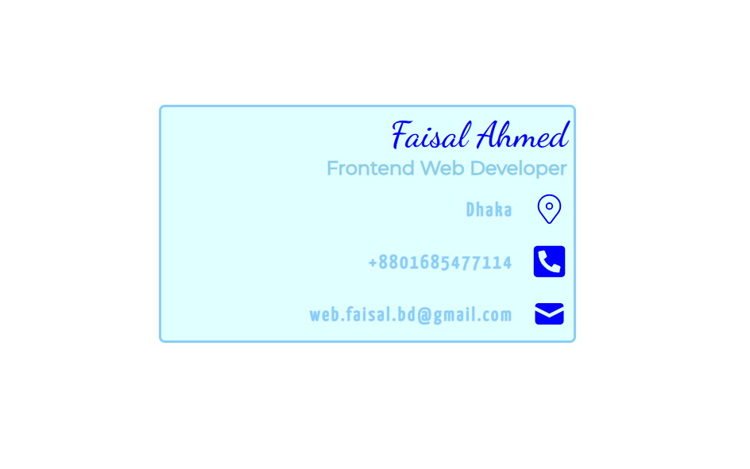

# React Icons

### Link: https://webfaisalbd.github.io/react-icons-ai/

<p align='center'>
  
</p>

---

- `App.js`
```html
<div className='parentCard'>
      <div className="mainCard">
        <div className="profileCard">
          <h2 className="cardTitle">Faisal Ahmed</h2>
          <h4 className="cardDesignation">Frontend Web Developer</h4>
        </div>
        <div className="contactCard">
          <div className="contactRight">
            <div className="location">
              <p>Dhaka</p>
              <p> <CiLocationOn className='icon' /> </p>
            </div>
            <div className="mobile">
              <p>+8801685477114</p>
              <p> <a href="http://wa.me/8801685477114" target="_blank" rel="noopener noreferrer"> <FaPhoneSquareAlt className='icon' /> </a> </p>
            </div>
            <div className="email">
              <p>web.faisal.bd@gmail.com</p>
              <p> <a href="mailto:web.faisal.bd@gmail.com"> <HiMail className='icon' /> </a> </p>
            </div>
          </div>
        </div>
      </div>
    </div>
```

---

- `style.css`
```css
* {
    margin: 0;
    padding: 0;
    box-sizing: border-box;
}

@import url('https://fonts.googleapis.com/css2?family=Dancing+Script:wght@600&family=Montserrat&family=Yanone+Kaffeesatz&display=swap');
/* 
font-family: 'Dancing Script', cursive;
font-family: 'Montserrat', sans-serif;
font-family: 'Yanone Kaffeesatz', sans-serif; 
*/

.parentCard {
    display: flex;
    align-items: center;
    justify-content: center;

    margin: 10% 0;
}

.mainCard:hover {
    background: lightgoldenrodyellow;
}

.mainCard {
    width: 350px;
    height: 200px;
    border: 2px solid lightskyblue;
    background: lightcyan;
    border-radius: 5px;
}

.mainCard .profileCard {
    padding: 5px;
}

.profileCard .cardTitle {
    color: blue;
    font-family: 'Dancing Script', cursive;
    font-weight: 700;
    font-size: 30px;
    text-align: end;
}

.profileCard .cardDesignation {
    color: skyblue;
    font-family: 'Montserrat', sans-serif;
    text-align: end;

}

.contactCard {
    /* border: 2px solid green; */

    display: flex;
    justify-content: flex-end;
}


.location,
.mobile,
.email {
    color: lightskyblue;
    padding: 5px;
    font-weight: 700;

    font-family: 'Yanone Kaffeesatz', sans-serif;
    letter-spacing: 2px;

    display: flex;
    justify-content: flex-end;
    align-items: center;
    gap: 15px;
}

.icon {
    font-size: 30px;
    color: blue;
}
```